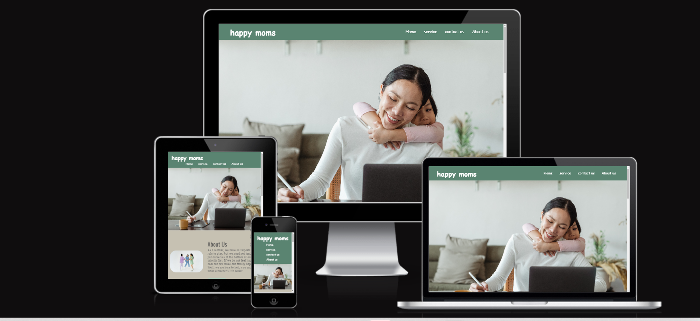

# happy-momes

[View the live project here.](https://mahsak89.github.io/happy-moms/)

It is a website which intend to help and reach mothers in.

## **Description**

Moms are often pushed to the end of their rope with all of the emotional, physical, and developmental needs of their children.
One of the consistent traits associated with a “happy mom” is the act of self-care and gaining access to those authentic moments of happiness.
we are here to help mothers who need help.
Remember : A happy mom = Happy home

## Business Goals

### User Goals
- Meet the other mothers, with the same situation 
- Book an online terapi 
- Join the workout group at gym or outside
- Make new friends

### Website Owner Goals
- book online therapy for only mothers
- make events every week to buld a network
- Increase the privacy policy for customers
- Provide a form to enquire about services provided
- create online training once per week 

- #### Typography

  - Lato and Oswald font are the main fonts used throughout the whole website with Finger Paint and cursive as the fallback font in a case for any reason the font isn't being imported into the site correctly.

- #### Colour Scheme

     The 6 main colors used are:
    
    - ##5a8471 for the heder background and the footer which is close to the green.

    - #c6c1b2 for hovers which is close to the gray-brown.

    - rgba(198, 193, 178, 0.3) for about section and contact section which is a light gray.
    - rgba(177, 203, 187,1) for buttons and  rgba(177, 203, 187,.8) for buttons hover which are greenish
    - rgba(242, 242, 242) for services which is close to white  
    - rgb(214, 224, 245) for cards and rgba(214, 224, 245,.8) for contact form which are a light blue
    

## Features
The website contains 1 page including 3 sections

- Interactive elements.

- Informative item descriptions.

- Easy to use.

- simple navbar menu is unique which makes navigation easier.

- Beautiful photos of the dishes and drinks attract the customers.

- It's easy to find navbar, contacts, social media links in the the pages.

[Header/ hero img](assets/image/header-heroimage.png)

[Section 1](assets/image/section-1.png)

[Section 2](assets/image/section-2.png)

[section 3](assets/image/section-3.png)

[Footer](assets/image/footer.png)

## Testing

**general testing:**

The W3C Markup Validator and W3C CSS Validator Services were used to validate every page of the project to ensure there were no syntax errors in the project.

## HTML Validation

[View the errors that I fixed.](assets/image/Error-html.png)

The Nu HTML Checker (W3C) is used to validate HTML documents. It found two errors indicated, and I fixed them.
- missing lang="en"
- chande section to div for the hero image.

## CSS Validation

The W3C Jigsaw CSS Validation Service is used to validate CSS documents. The page passed without any errors.

- [W3C Markup Validator](https://validator.w3.org/) : [Result](assets/image/html-validator1.png)

- [W3C CSS Validator](https://jigsaw.w3.org/css-validator/) : [Result](assets/image/css-validator1.png)

- [Grammarly](https://app.grammarly.com/) used to fix any misspells.

- Social links are linked to the right page and open a new tab when clicked on.

### **Further Testing**

- [x] The Website was tested on Google Chrome, Microsoft Edge, and Firefox browser.

- [x] The website was shown responsive on a variety of emulated devices such as Jio phone, iphone4, 5, SE, 6, 6 plus, 7, 7plus, 8, 8plus and X, Nokia Lumia 520 and N9, Moto G4, Galaxy S5, Blackberry Z30 and playbook, Galaxy note, Microsoft Lumia 950 and 550, LG Optimus L70, Nexus 4, 5, 6, 7 and 10, 6P, Pixel 2 and 2XL, iPad mini, iPad, Kindle Fire, iPad pro and laptop with MDPI, touch, and HiDPI.

- [x] A large amount of testing was done to ensure that all pages were linking correctly.

- [x] Friends and family members were asked to review the site and documentation to point out any bugs and/or user experience issues.

## **Technologies Used**

### **Languages Used**

- [HTML5](https://en.wikipedia.org/wiki/HTML5)

- [CSS3](https://en.wikipedia.org/wiki/Cascading_Style_Sheets)

### **Frameworks, Libraries & Programs Used**

- [Google fonts](https://fonts.google.com/)

  - Google fonts Roboto and Baloo Bhaina are used on all pages throughout the project.
  - Font Awesome

- [Git](https://en.wikipedia.org/wiki/Git)

  - Git was used for version control by utilizing the Gitpod terminal to commit to Git and push to GitHub.

- [github](https://github.com/)

  - GitHub is used to store the project's code after being pushed from Git.

- [gitpod](https://www.gitpod.io/)

  - Gitpod is used for testing the project.

- [Font Awesome](https://fontawesome.com/) 
  - Font Awesome is used for my icons.
   
- [Pexels](https://www.pexels.com/)
  - Pexels is used for images  in this site

  ## Acknowledgements

1. A special thanks to my mentor, Agshat Garg, for his valuable feedback during mentoring sessions.

1. Also, I like to thank all of the Code Institute support groups.

1. The design and layout of this website are based on the Rule of Thirds.

1. All the images on the website have an external source and have been used for only educational purposes.

1. Code Institute tutorials were very helpful throughout the whole project.

## 🚀 About Me
I'm a  student full stack developer

## Authors
- [@Mahsak89](https://github.com/Mahsak89)

## **Deployment**

Following steps has been taken to deploy Happy Moms website on GitHub pages;

1. Go to GitHub and click on repository [Mahsak89/happy-moms](https://github.com/Mahsak89/happy-moms)

1. Click on **Settings** on the top right of the page

1. on left side click **GitHub pages section**

1. Click on **dropdown menu** under **Source** section and select **Master Branch as Source**

1. The page will automatically refresh.

1. Scroll back down through the page to locate the now published site link in the "GitHub Pages" section.

